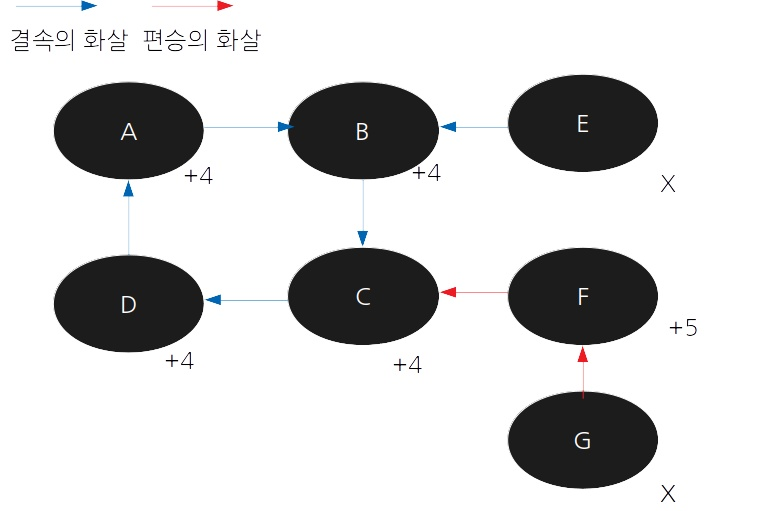
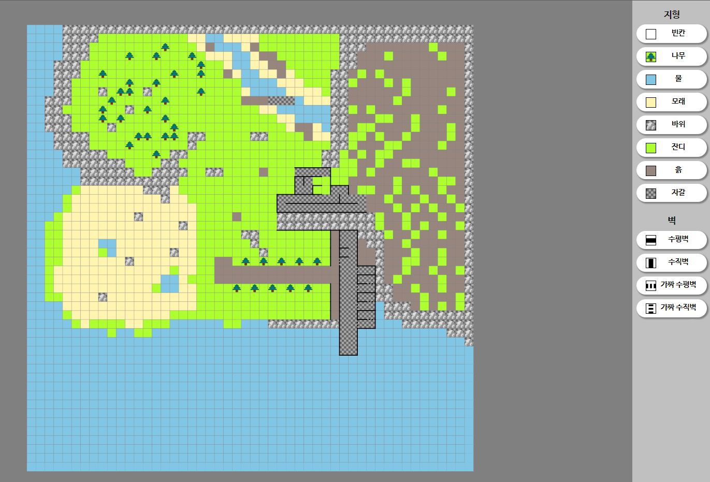
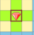
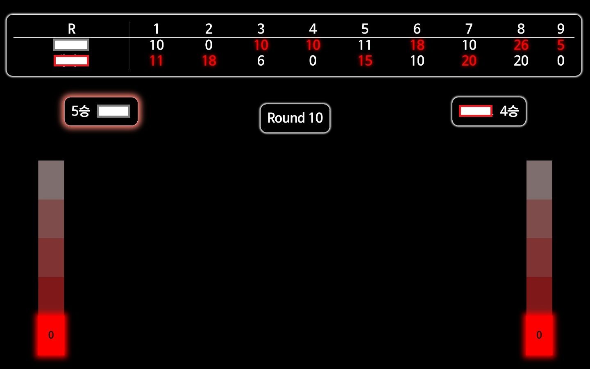

# Table of Contents
1. [체계단 더지니어스 Top 11 메인 매치 - 결속의 화살](#체계단-더지니어스-top-11-메인-매치---결속의-화살)
2. [체계단 더지니어스 Top 7 메인 매치 - 숫자 술래잡기](체계단-더지니어스-top-7-메인-매치---숫자-술래잡기)
3. [체계단 더지니어스 Top 6 메인 매치 - 비둘기 아파트](#체계단-더지니어스-top-6-메인-매치---비둘기-아파트)
4. [체계단 더지니어스 Top 5 메인 매치 - 주가 조작](#체계단-더지니어스-top-5-메인-매치---주가-조작)
5. [체계단 더지니어스 Top 4 메인 매치 - 씨앗 경매](#체계단-더지니어스-top-4-메인-매치---씨앗-경매)
6. [체계단 더지니어스 Top 3 메인 매치 - 유적 탐험 레이스](#체계단-더지니어스-top-3-메인-매치---유적-탐험-레이스)
7. [체계단 더지니어스 Top 3 데스매치 - 100](#체계단-더지니어스-top-3-데스매치---100)
8. [체계단 더지니어스 결승 메인 매치 - 시장에 가면](#체계단-더지니어스-결승-메인-매치---시장에-가면)

-----------------------------------

# 체계단 더지니어스 Top 11 메인 매치 - 결속의 화살

1. 게임은 총 5개의 라운드로 진행된다.
2. 각 라운드마다, 10분의 자유 시간이 주어진다. 자유 시간 동안 플레이어는 원하는 장소를 돌아다니며 다른 플레이어와 자유롭게 이야기할 수 있다.
3. 자유 시간이 끝난 뒤, 플레이어는 한 플레이어를 지목하여 결속의 화살 또는 편승의 화살을 발사해야 한다. 발사는 딜러(상병 배준익)에게 다음과 같은 형식의 개인 채팅을 보내는 방식으로 이루어진다.
```
[발사 대상], [발사할 화살의 종류]

ex) 홍길동: 배준익, 결속 
ex) 배준익: 홍길동, 편승
```
- 3-1. 만약 플레이어 간에 결속의 화살만으로 이루어진 고리가 존재한다면, 고리에 소속된 플레이어들은 고리를 구성하는 플레이어 수만큼 점수를 획득한다.
- 3-2. 결속의 화살로 이루어진 고리에 편승의 화살이 발사되었다면, 편승의 화살을 발사한 플레이어는 (고리에 소속된 플레이어 수 + 1) 만큼의 점수를 획득한다.
4. 플레이어의 최종 점수는 각 라운드별 획득한 점수의 총합이다. 
- 4-1. 최종 점수가 동일한 플레이어 사이에서는 지금까지 발사한 편승의 화살 수가 더 많은 플레이어가 더 높은 순위이다.
  - 4-1-1. 지금까지 발사한 편승의 화살 수도 같은 경우 가위바위보로 순위를 정한다.
5. 순위가 가장 낮은 두 명의 플레이어는 데스 매치의 대상이 되며, 순위가 가장 높은 한 명의 플레이어는 우승시 상금이 (?) 원 추가된다.



----------------------------
# 체계단 더지니어스 Top 7 메인 매치 - 숫자 술래잡기

1. 게임은 총 10라운드로 이루어진다.
 
2. 각 플레이어들은 4부터 8까지의 수 중 하나를 선택하여 시작한다. 해당 숫자는 플레이어의 처음 위치를 나타낸다. 플레이어들의 위치는 본인을 제외하고 비공개이다.
 
3. 플레이어 중 한 명은 가위바위보로 첫 번째 술래로 선정된다. 술래의 위치는 공개된다.
 
4. 도망자 플레이어들은 각 라운드마다 다음 중 한 가지의 행동을 선택하여, 딜러에게 비밀리에 전달한다.
- 4-1. 자신의 위치를 +1하거나, -1 한다.
- 4-2. 자신이 지목한 플레이어의 위치로 이동한다. 이때의 위치는 해당 플레이어가 이번 라운드에 움직이기 이전의 위치를 의미한다.
- 4-3. 자신이 지목한 두 플레이어의 위치의 평균점으로 이동한다. 소수점이 나올 경우 반올림한다.
이동 후 본인의 위치를 알 수 있다.
 
5. 술래는 이동이 불가하다. 술래는 플레이어 중 한 명을 비밀리에 지목한다. 라운드가 끝나면 해당 플레이어의 이동 후 위치를 확인할 수 있다.
 
6. 모든 플레이어의 이동이 끝난 후, 도망자 플레이어 중 술래와 가장 가까운 플레이어는 술래가 되며, 승점 1점을 술래에게 헌납한다. 잡히지 않은 도망자 플레이어들은 승점 1점을 획득한다.
- 6-1. 술래의 이름은 공개되지 않으며, 술래의 위치는 공개된다.
- 6-2. 술래와 가장 가까운 도망자 플레이어가 두 명 이상일 경우, 해당 도망자 플레이어들은 승점 1점씩을 술래에게 헌납하며, 승점이 더 낮은 플레이어가 술래가 된다.
- 6-3. 만약 도망자 플레이어의 위치가 술래의 위치와 동일한 경우, 술래는 도망자 플레이어에게서 승점 5점을 빼앗는다.
 
7. 게임이 끝난 후, 게임 승점으로 순위를 매겨 승점이 가장 적은 플레이어 두 명은 탈락 후보가 된다.


--------------------------

# 체계단 더지니어스 Top 6 메인 매치 - 비둘기 아파트

비둘기 아파트는 3층으로 구성된다.

- 3층 - 10점___O
- 2층 - 5점___O_O
- 1층 - 1점__O_O_O


층별 최대 수용 알 개수는 각각 1층 3개, 2층 2개, 3층 1개이며, 층별 배치된 알의 점수는 1층 1점, 2층 5점, 3층 10점이다.

1. 플레이어는 알 10개를 가지고 게임을 시작하며, 게임은 총 10라운드로 진행된다.
- 1-2. 점수판에 각 플레이어의 점수와 남은 알 개수는 익명으로 공개된다.
2. 라운드마다 플레이어는 비둘기 아파트 각 층에 원하는 만큼 자신의 알을 배치할 수 있다.
- 2-1. 알을 놓지 않는 것도 가능하다.
- 2-2. 이때 알의 배치는 비공개로 진행된다.
3. 라운드 시간이 끝나면, 모든 알의 배치를 공개한다. 각 플레이어가 배치한 알은 다음과 같은 기준으로 점수를 부여받는다.
- 3-1. 알이 속한 층이 최대 수용 알 개수를 넘지 않은 경우: 층별 점수를 얻는다.
- 3-2. 알이 속한 층이 최대 수용 알 개수를 넘은 경우: 해당 층의 알이 모두 깨지며 점수를 얻지 못한다.
4. 새로운 라운드가 시작되면 플레이어가 배치했던 알은 모두 사라진다.
5. 모든 라운드가 끝나고 가장 높은 점수를 가진 플레이어는 생명의 징표를 2개 획득하며, 다른 플레이어에게 생명의 징표 하나를 양도할 수 있다. 가장 낮은 점수를 가진 플레이어는 데스매치 대상이 되며, 생명의 징표를 가지지 않은 다른 플레이어 한 명을 데스매치 상대로 지목할 수 있다.
- 5-1. 최고 점수가 같은 플레이어가 두 명 이상인 경우 모두 생명의 징표를 하나씩 받는다.
- 5-2. 점수가 최저인 플레이어가 두 명 이상일 경우 남은 알 개수가 더 적은 플레이어가 데스매치 후보가 된다.

1, 4, 7라운드가 끝나고, 각각 15분의 논의 시간이 주어진다.

--------------------

# 체계단 더지니어스 Top 5 메인 매치 - 주가 조작
Top 5 메인 매치 - 주가 조작

이 게임에는 두 가지 종목이 있다.
1. 우량주. 초기 가격 100,000원. 10,000원당 등락량을 1,000원씩 조작할 수 있음.
2. 잡주. 초기 가격 10,000원. 10,000원당 등락량을 300원씩 조작할 수 있음.
 
각 플레이어들의 초기 자금은 1,000,000원이다.

플레이어들은 주식 거래가 열리는 7일동안, 주식 거래를 통해 최고의 부자가 되어야 한다.
 
주식에는 등락량의 개념이 있다. 이 등락량은 날짜가 바뀌어도 초기화되지 않으며, 플레이어들이 조작하는 데 자금을 사용해야만 바뀔 수 있다.  
예를 들어, 우량주 종목 가격이 100,000인 상황에서 플레이어 A가 30,000원을 소모하여 등락량을 3,000원 올리고, 플레이어 B가 20,000원을 소모하여 등락량을 2,000원 내렸다고 하자.  
다음 날짜에 해당 종목의 등락량은 +1,000원이며, 종목의 가격은 101,000원이 된다.  
이 상황에서 플레이어 A가 20,000원을 사용하여 등락량을 2,000원 올린다면, 다음 날짜의 주식 가격은 현재의 등락량에 2,000원이 더해져 등락량은 +3,000으로 바뀌며 해당 주식은 104,000원이 될 것이다.


각 날짜의 장이 열리기 전에, 플레이어는 은행에 빚을 지는 것이 가능하다. 빚의 한도는, 자신의 자금이 "자금이 가장 많은 플레이어의 자금"이 될 수 있을 때까지이다. 이에 따라, 자금이 가장 많은 플레이어는 빚을 질 수 없다.  
빚에 해당하는 금액은 다음날 자신의 자산에서 자동으로 차감되며 이자는 없다.
 
장이 열리면, 플레이어는 다음의 행동이 가능하다.
1. 자신이 보유한 자산 내에서 주식 종목을 원하는 만큼 구매한다.  
1-1. 이때 플레이어가 구매한 주식은, 그 다음 날 자동으로 판매 처분된다.  
2. 주식의 다음 날 등락량을 조작하는데 자금을 사용할 수 있다.  

만약 종목의 가격이 계속 하락하여 0원 이하가 된다면, 그 주식은 상장폐지된다. 즉 해당 종목에 투자된 자산은 회수받지 못하며, 앞으로도 그 종목에 투자가 불가능하다.

시작 날짜로부터 7일 뒤에, 자산이 가장 많은 플레이어는 생명의 징표를 2개 가지며 한 개를 양도하는 것이 가능하다. 양도 대상은 데스매치 대상자를 제외한 플레이어 중 한 명이다.  
자산이 가장 적은 플레이어는 데스매치 후보가 되며, 다른 플레이어 한 명을 데스매치 후보로 지목할 수 있다.  
(자산이 가장 많은 플레이어가 두 명 이상인 경우, 각각 생명의 징표를 1개씩만 가지게 된다.)  
(자산이 가장 적은 플레이어가 두 명 이상인 경우, 그 중 두 명이 데스매치 후보로 지정된다.)  


게임을 진행하는 동안, 전광판에는 주식 종목의 가격과 등락량, 자금이 가장 많은 플레이어의 자금만이 표시된다.


--------------------

# 체계단 더지니어스 Top 4 메인 매치 - 씨앗 경매

4인 메인 매치 - 씨앗 경매

이 게임에는 쌀, 보리, 조, 콩 4개의 작물이 존재한다.

1. 각 플레이어들은 시작 금액으로 200원씩을 받으며, 본인 소유의 밭을 가지고 있다.
2. 게임이 진행되는 동안 플레이어는 다음의 행동을 할 수 있다.
- 2-1. 자신이 보유한 씨앗을 심는다. 씨앗을 심는 데에 소요되는 시간은 2분이며, 밭에는 최대 5개의 씨앗만 심을 수 있다. 이때 심은 작물의 가치는 기본 100원이며, 같은 종류의 작물을 연속해서 심는 경우에는 이전에 심은 작물의 가치에 100원씩 더한 값이 된다.
예를 들어, 플레이어가 보리, 보리, 보리, 쌀, 보리 순서로 씨앗을 심는 경우, 곡물의 가치는 각각 100원, 200원, 300원, 100원, 100원이다.
- 2-2. 밭에 있는 작물들을 한 번에 모두 수확한다. 수확에 소요되는 시간은 3분이다. 수확을 하는 경우, 현재 밭에 심은 작물들의 총 가치에 해당하는 금액을 한 번에 얻는다.
  - 2-2-1. 수확하는 시점에서 4개 종류의 작물이 모두 밭에 심어져 있다면, 추가적으로 300원을 받을 수 있다.
3. 게임이 진행될 때 10분마다 게임이 잠시 중단되고, 씨앗 경매가 열린다. 자신이 진행하고 있는 행동의 타이머 역시 중지된다.
- 3-1. 경매 단계에서는 라운드별 경매 리스트에 올라간 씨앗을 경매로 구매할 수 있다. 이때 씨앗의 최소 금액은 10원이며, 10원 단위로 가격을 올릴 수 있다. 가장 높은 가격을 제시한 플레이어가 해당 가격으로 씨앗을 구매할 수 있다. 
- 3-2. 단 자신이 심지 않고 소유한 씨앗이 10개 이상이면 경매에 참여가 불가능하다.
4. 게임은 마지막 경매가 열리고 10분 뒤에 종료되며, 게임이 종료될 때 가장 낮은 금액을 소지한 두 명의 플레이어가 데스매치 대상이 된다.


------------------

# 체계단 더지니어스 Top 3 메인 매치 - 유적 탐험 레이스

- https://github.com/CGDTheGenius/Top3MainMatchFront
- https://github.com/CGDTheGenius/Top3MainMatchBack

### 3인 메인 매치 - 유적 탐험 레이스

당신은 외딴 혹성의 고대 유적 탐험 레이스에 참가 중입니다. 이 유적에 고대 유물이 잠들어 있다는 사실이 밝혀져 있습니다. 단, 유적 곳곳에 흩어진 유물 4개를 모두 모아 조립해야 한다고 합니다. 고대 유물에서는 물질을 통과하는 특별한 신호가 발생하고 있고, 당신의 팀이 제작한 특별 신호 탐지기를 이용하여 각각의 유물의 방향을 알 수 있습니다. 그러나 유적은 미로와도 같아서 방향만으로는 쉽게 유물에 도착하기가 힘듭니다. 하지만 당신에게는 조력자가 있습니다. 조력자는 상공에서 지상을 내려다 보며 길을 알려줄 수 있지만 당신의 위치와 유물의 위치는 알 수 없습니다. 게다가 이 혹성에는 항상 강한 태양풍이 불기 때문에 상공과 지상 사이의 통신이 원활하지 않아 의사소통에 제약이 있습니다. 한 번에 통신 가능한 데이터는 **세 글자**가 최대라고 합니다.

이런 곤란한 상황이지만 당신은 전혀 두렵지 않습니다. 조력자와 협력하여 다른 팀보다 빠르게 고대 유물을 찾으십시오!

유적은 정해지지 않은 크기의 격자 무늬로 되어있습니다. 각 칸은 빈 칸이거나, 지형지물이거나, 유물이거나, 통신탑입니다. 또한 칸과 칸 사이에 벽이 존재할 수 있습니다.

- 타일
    - 유적은 정사각형 형태의 타일로 구성됩니다. 타일에는 밟을 수 있는 타일과, 밟지 못하는 타일이 있습니다.
    - 밟을 수 있는 타일
        - 잔디
        - 흙
        - 자갈
        - 모래
    - 밟을 수 없는 타일
        - 나무
        - 바위
        - 물
    - 만약 플레이어가 밟을 수 없는 타일로 이동한다면, 해당 턴의 이동은 무효가 됩니다.
- 벽
    - 벽은 타일과 타일 사이에 존재하며, 플레이어는 벽을 넘어서 이동할 수 없습니다.
    - 이동 시 벽에 부딪힌다면, 해당 턴의 이동은 무효가 됩니다.
- 유물
    - 유물은 1x1 타일 위에 존재합니다.
    - 4개의 유물은 각각 다른 색깔을 가지고 있고, 유물은 종류별로 3개씩 존재합니다.
        - 즉, 한 플레이어가 유물을 먼저 가져간다고 하더라도 다른 플레이어가 가져갈 유물이 남아있습니다.
    - 플레이어가 유물이 있는 칸에 정지하면, 유물을 획득할 수 있습니다.
    - 같은 종류의 유물은 한 번만 획득할 수 있습니다.
- 통신탑
    - 플레이어가 조력자와 통신할 수 있도록 도와줍니다. 플레이어가 통신탑을 중심으로 3x3 범위 안에 있다면, 조력자에게 정보를 보낼 수 있습니다.
    - 통신탑은 타일 한 칸을 차지합니다.
    - 통신탑이 있는 타일은 밟을 수 없는 타일입니다. 즉, 이동 시 통신탑과 부딪히는 경우는 해당 턴의 이동은 무효가 됩니다.

플레이어와 조력자가 번갈아가며 턴이 이루어집니다. 조력자가 먼저 턴을 가집니다.

- 조력자 턴: 플레이어에게 3글자 말을 전달합니다. (항상 플레이어에게 전달됩니다.)
    - 이때 글자는 다음의 조건을 만족해야 합니다.
        1. 한글의 자음 또는 모음
            1. ex) ㄱ, ㅏ, ㅖ
        2. 한글의 초성 + 중성 (+ 종성)으로 이루어진 한 글자
            1. ex) 체, 계, 단, 값, ...
- 플레이어 턴: 다음 행동 중 하나를 취합니다.
    - 현재 바라보는 방향을 기준으로 앞이나 뒤로 1~10칸 움직입니다. 이때 벽이나 지형지물을 뛰어넘을 수는 없으며, 움직였을 때 이에 부딪히는 경우 해당 턴은 무효가 됩니다.
    - 왼쪽 또는 오른쪽으로 90도 회전합니다.
    - 조력자에게 3글자 말을 전달합니다. (플레이어가 통신탑을 중심으로 3x3 격자 이내에 있을 경우에만 조력자에게 전달됩니다.)
        - 이때에도 역시 위의 조건을 만족하는 글자만 전송할 수 있습니다.

- 조력자는 전체 지도를 볼 수 있습니다. 이때, 벽과 타일의 종류를 제외한 다른 정보는 일체 주어지지 않습니다.
- 플레이어는 지도 상의 자신의 위치를 알지 못하지만, 자신의 위치를 중심으로 주변의 3X3 칸을 볼 수 있습니다. 즉 해당 칸 내의 벽과 지형지물, 유물, 통신탑을 확인할 수 있습니다. 다른 플레이어가 자신의 시야 범위 내에 있는 경우, 해당 플레이어의 위치 역시 표시됩니다.
- 플레이어에게는 유물이 존재하는 방향이 플레이어를 둘러싼 원주상에 표시됩니다. 유물까지의 거리는 표시되지 않습니다.
- 플레이어의 시작위치는 통신탑을 기준으로 3x3 범위 내에서 랜덤하게 결정됩니다.
- 조력자와 플레이어는 게임 내의 통신을 제외한 의사소통이 불가능합니다.
- 플레이어와 조력자는 전용 페이지가 있습니다. 혹시 모를 부정 통신(?)을 막기 위해, 해당 페이지만 이용 가능한 점을 참고바랍니다.
- 턴에 시간 제한이 있을 예정입니다. (다른 플레이어가 너무 오래 기다리는 것을 막기 위함) 대략 1~2분입니다.
- 4개의 유물을 가장 먼저 획득한 플레이어가 승리하지만, 게임은 다른 플레이어가 4개의 유물을 모두 획득하기 전까지 계속 진행됩니다. 4개의 유물을 두 번째로 모두 획득한 플레이어는 데스매치에서 선공/후공을 결정할 권한이 주어집니다.

게임이 시작되면, 조력자에게 몇 가지의 추가적인 정보가 공개됩니다.

- ex) *** **** 위한 ** **

### 조력자용 매뉴얼


- 가짜 벽이 존재합니다. 가짜 벽은 플레이어의 눈에는 진짜 벽처럼 보이지만, 통과할 수 있습니다. 가짜 벽의 위치는 지도에 표시되어 있습니다.
- 유물을 획득하기 위한 특수 행동 - 유물은 특수한 결계로 둘러싸여 있습니다. 각 유물마다 존재하는 특수한 조건을 만족해야 유물을 둘러싸는 결계가 없어질 것입니다.
    - 빨간색 유물 - 유물 주위 3x3칸의 네 모서리를 모두 밟으면 결계가 해제됩니다. 다음 사진에서 색칠된 모서리를 한 번 이상 밟아야 합니다. 밟는다는 것은 이동 결과 해당 위치에 정지하는 것입니다. 예시로, 다음과 같은 사진에서는 모래 타일이 있는 위치를 모두 밟아야 합니다.
    
    
    
    - 노란색 유물 - 유물 바로 옆 칸으로 이동 후 제자리에서 360도 연속으로 회전하면 결계가 해제됩니다. 이때 옆 칸은 상하좌우 칸이 모두 가능합니다. 4턴 만에 회전 후 원래 방향으로 돌아와야 합니다.
    - 초록색 유물 - 뒷걸음질로 유물 칸으로 이동하면, 유물의 결계를 뚫고 유물을 획득할 수 있습니다.
    - 파란색 유물 - 조력자가 “따라해”라는 메시지를 보낸 직후, 플레이어가 통신탑을 이용해 조력자에게 “따랑해”라는 메시지를 보내는 순간, 결계가 해제됩니다.

- 워프 트랩이 존재합니다. 워프 트랩은 유물의 형태를 하고 있습니다 - 플레이어의 방향계에는 일반적인 유물처럼 방향이 표시되며, 플레이어 눈에는 일반적인 유물처럼 보입니다. 플레이어가 가짜 유물이 있는 칸에 정지할 경우 특정한 장소로 이동하게 됩니다. 해당 장소의 위치는 조력자에게 공개되지 않습니다.


-------------------

# 체계단 더지니어스 Top 3 데스매치 - 100

- https://github.com/CGDTheGenius/Top3DeathMatchFront
- https://github.com/CGDTheGenius/Top3DeathMatchBack



- 각 플레이어는 100포인트씩을 지급받는다.
- 각 플레이어는 포인트 표시등을 가지고 있다. 포인트 표시등은 자신의 포인트를 다섯 단계로 표시해 주며, 각각 남은 포인트가 각각 0 이상, 20 이상, 40 이상, 60 이상, 80 이상임을 나타낸다.

- 라운드마다, 플레이어는 자신이 가진 포인트 중 일부를 제시한다. 포인트 제시는 선공 → 후공 순서로 이루어지며, 상대가 제시한 포인트의 정확한 수치는 표시되지 않는다.
  - 이때, 제시한 포인트가 10 이상인지, 10 미만인지 여부가 즉시 상대 플레이어에게 고지된다.
- 포인트를 제시하는 순간 해당 포인트는 소멸된다. 즉, 플레이어의 남은 포인트는, 
```
(기존에 가지고 있었던 포인트) - (제시한 포인트)
```
가 된다.
- 포인트를 제시하는 순간 포인트 표시등의 단계가 자신의 남은 포인트에 맞게 변경된다. 따라서, 후공 플레이어는 선공 플레이어의 포인트 표시등이 변경된 것을 확인할 수 있다.
- 두 플레이어가 모두 포인트를 제시하였다면, 서로가 제시한 포인트를 비교해 포인트가 더 많은 쪽이 승점 1점을 갖게 되며, 다음 라운드의 선공이 된다.
  - 이때, 포인트의 비교는 비공개로 이루어진다.
  - 만약 서로가 제시한 포인트가 같은 경우, 두 플레이어 모두 승점을 획득하지 못하며, 후공인 플레이어가 다음 라운드의 선공이 된다.

- 먼저 승점 5점을 획득한 플레이어가 승리한다.
- 만약 두 플레이어 모두 모든 포인트를 소모하였는데 게임이 끝나지 않은 경우, 각 플레이어는 포인트 33점씩을 새로 할당받고 추가 경기를 진행한다.

---------------------

# 체계단 더지니어스 결승 메인 매치 - 시장에 가면

게임은 라운드 단위로 이루어진다.
- 각 플레이어는 번갈아가며 단어를 하나씩 이야기한다. 이때, 단어의 최대 길이는 10자이다.
- 단어를 모두 이야기하면, 단어를 마지막으로 말한 플레이어부터 지금까지 말했던 단어를 순서대로 하나씩 복기한다. 이때 최대 시간은 2분이다.
- 만약 복기에 실패하면, 상대 플레이어가 나머지 단어를 모두 복기하여야 한다.
  - 두 플레이어 모두 복기에 실패한 경우, 라운드를 재개한다.
  - 두 플레이어 모두 복기에 성공한 경우, 단어 개수를 늘려 새로운 라운드가 이루어진다.
  - 한 플레이어만 모두 복기에 성공한 경우, 1점을 가져간다.
- 2점을 먼저 가져가는 플레이어가 승리한다.

- 추가적으로, 게임 중 단 한번만 사용할 수 있는 아이템이 있다.
1. 턴 넘기기, 사용 시 자신의 턴이 스킵되며, 자신이 복기해야 할 단어는 상대의 턴으로 넘어간다.
2. 첫 글자 힌트. 지금 복기해야 할 단어의 첫 글자를 알 수 있다.
3. 카오스. 사용 시 두 플레이어 모두 이번 라운드의 단어는 순서와 무관하게 복기할 수 있다.
